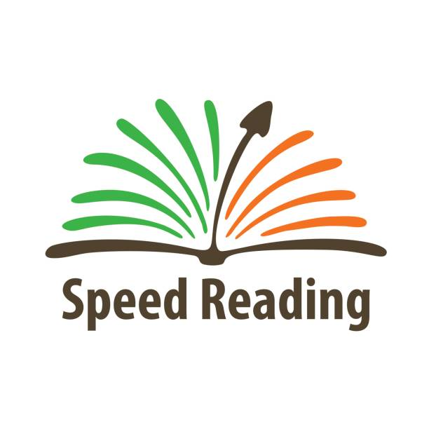

# Speed Reading Trainer



This is a Speed Reading Trainer program created with Python using the `tkinter` library. The program helps you improve your reading speed by displaying text at a rate of more than 320 words per minute.

## How to Use

1. Clone or download this repository.

2. Run the Python script using your preferred Python environment.

3. Enter the text you want to practice in the terminal, replacing all 'enter' with spaces.

4. Enter your desired words-per-second rate (optimal: 320+).

5. Click on the "Press here to start" label in the GUI.

6. Watch the words appear one by one at the speed you specified.

## Requirements

- Python 3.x
- tkinter (usually included with Python)

## Usage

1. Clone the repository:

   ```bash
   git clone https://github.com/Anready/speed-reading-trainer.git
   ```

2. Navigate to the project directory:

   ```bash
   cd speed-reading-trainer
   ```

3. Run the program:

   ```bash
   python speed_reading_trainer.py
   ```

## Customization

You can customize the program by modifying the Python script `speed_reading_trainer.py`. Adjust the initial message, text color, background color, and other settings to suit your preferences.

Feel free to contribute to and enhance the program!

## Acknowledgments

This Speed Reading Trainer program was created by AnreadyX. Special thanks to the Python community for the tkinter library.

Use this tool to practice and enhance your reading speed, tackling even large texts with ease!

# License

License (MID) in file LICENSE